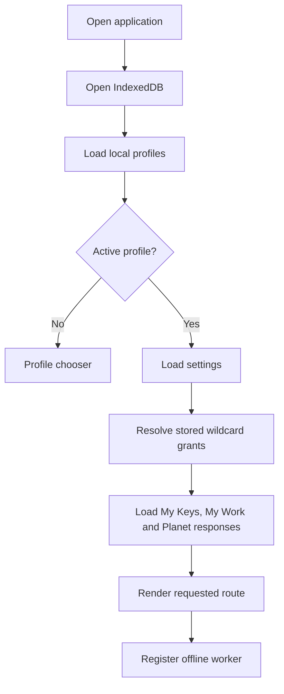
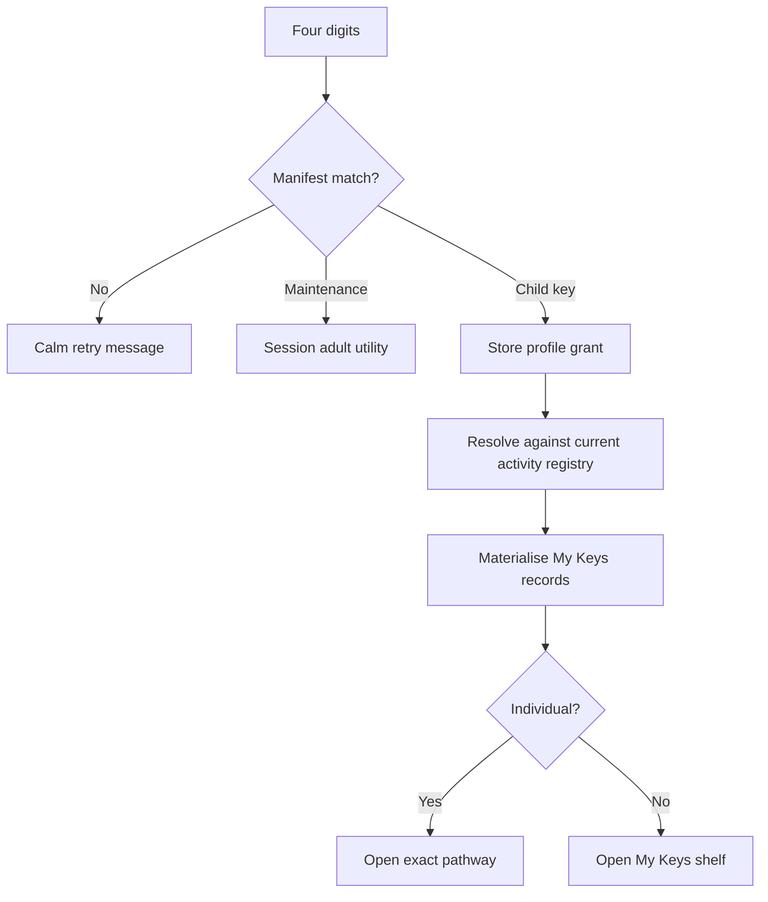

# Architecture

## Product invariants

These rules are architectural, not presentational:

1. Completed curriculum environments are open without a key.
2. Keys remember and route to guided pathways; they do not grant ordinary exploration.
3. Child navigation remains Our Planet, My Keys, My Work, and Enter a Key.
4. One profile’s keys, work, drafts, responses, and settings never leak into another profile.
5. One shared artefact schema serves every environment.
6. Key codes and stable IDs are never reassigned after release.
7. Destination and world wildcards retain future meaning.
8. Later builds use additive migrations and preserve all prior local data.
9. Inactive destinations have no child-facing dead controls.
10. Physical art is documented digitally without being replaced by a drawing app.

## Application startup

If IndexedDB fails to open, the same service API switches to in-memory storage for that page session. The UI remains operable and can communicate that durable saving is unavailable.

## Route model

Hash routes keep GitHub Pages hosting simple and offline-safe.

| Route | Purpose | Key required? |
|---|---|---:|
| `#/home` | Open world | No |
| `#/atlas` | Planet Atlas exploration | No |
| `#/keys` | Remembered guided pathways | Profile only |
| `#/work` | Unified child workspace | Profile only |
| `#/work/:id` | Saved artefact | Profile only |
| `#/key` | Four-digit entry | Profile only |
| `#/activity/:id` | Exact Key Activity | Matching remembered grant |
| `#/settings` | Learner accessibility settings | Profile only |
| `#/maintenance` | Adult utility | Maintenance session |
| `#/print/key-guide` | Manifest-generated teacher guide | Maintenance session |

The router never produces subject lists, assignment pages, or dead future destinations.

## Destination registration

`src/data/destinations.js` contains all ten destinations. A destination record contains:

- stable ID
- title and short title
- order
- route namespace
- status
- activation build
- icon or landscape role
- curriculum domains
- supported capabilities

The home world derives active child destinations from this registry. Changing a destination from inactive to active is an explicit later-build release action.

## Activity registration

`src/data/activities.js` contains data-only Key Activity contracts. Each activity has:

- stable ID and route
- destination
- enquiry
- curriculum references
- concepts and vocabulary
- Notice / Explore / Make / Explain / Revisit flow
- response modes
- accessibility support
- optional unscored Key Check
- shared artefact outcome

Activity UI is rendered by `activityExperience.js`. The five conceptual moments are grouped into three child-facing stages, and `workflowVersion` safely maps unfinished legacy drafts into that reduced flow. Persistence and permissions do not depend on the visual layout.

## Key architecture

`src/data/keys.js` is authoritative. UI code never embeds released codes.

### Resolution

### Permission forms

- `activity:<id>` — one stable activity
- `destination:<id>:*` — all present and future activities in one destination
- `world:*` — all present and future activities across the product

The stored grant is the long-term source of truth. Materialised access records add display information, visit dates, and linked artefacts for the current registry.

### Future wildcard preservation

Later builds call `syncGrantedActivities(profileId, currentRegistry)`. Any activity matching an older wildcard is added to My Keys. The older grant is not rewritten, so Build 1 whole-world access continues to mean “every current and future pathway.”

## IndexedDB schema

Database: `our-planet`, schema version 3.

| Store | Key | Role |
|---|---|---|
| `profiles` | profile ID | local learner identity and accessibility snapshot |
| `keyGrants` | profile + stable key | permanent permission contract |
| `keyAccess` | profile + activity | materialised My Keys shelf and visits |
| `artefacts` | artefact ID | current saved creation |
| `artefactVersions` | artefact + version | immutable version snapshots |
| `planetResponses` | response ID | append-only central enquiry history |
| `activityState` | profile + activity | unfinished guided work |
| `metadata` | metadata key | active profile, settings, migrations and recovery |

Indexes always include profile identity where learner data is queried.

### Migration policy

- Add stores, indexes, or optional fields; do not clear stores.
- Keep old readers tolerant of missing optional fields.
- Validate records when read.
- Quarantine malformed records with a reason and timestamp.
- Never repurpose an existing field with a different meaning.
- Test migrations from every released schema version.

## Artefact compatibility

One artefact record can store a map, model, classification, story, artwork photograph, or explanation because domain content lives in `structuredContent` and identity lives in shared fields.

Core fields include:

- ID, profile, destination, activity, and optional Key Activity
- title and artefact type
- curriculum and concept tags
- structured content and preview
- voice and written explanations
- linked artefacts and reflection
- created, updated, version, and schema values

`updateArtefact` writes the prior and new states to `artefactVersions`. `duplicateArtefact` creates a new current record and links it to the source.

Planet Question responses remain separate because their append-only comparison timeline is a distinct product behavior.

## Planet Atlas engine

`AtlasMap` is a self-contained component with structured state input/output.

It uses:

- `d3-geo` for orthographic and flat projections, paths and distances
- `topojson-client` to decode country geometry
- `world-atlas/countries-110m.json` for the compact offline world view, with `countries-50m.json` loaded lazily for close country views

State includes:

- view and projection position
- zoom and pan
- labels, equator and ocean visibility
- tool mode
- selected place
- temporary markers
- two-point journey and narration
- comparison places
- geographical question

The engine owns no learner storage. The app saves `getState()` or `createSnapshot()` through the shared artefact service.

The engine is dynamically imported only when Atlas or an Atlas activity opens. The shell and learner workspace therefore load without parsing the full geographic dataset.

## Accessibility separation

Settings are stored per learner and passed into both CSS and interactive components.

The Atlas engine provides:

- keyboard rotation, pan, and zoom
- focusable SVG
- visible instructions
- live announcements
- marker and journey placement alternatives
- reduced-motion focus changes
- forced-colour rules

Activity scaffolding is a content-selection concern; it must not change permission, scoring, or curriculum status.

## Offline build

Vite outputs content-hashed chunks. `scripts/inject-sw-assets.mjs` scans `dist`, excludes source maps and the worker itself, and injects every deployable file into the worker’s precache list.

This matters because Planet Atlas is lazy loaded: it must still be available offline even if the child installed the app from the home world and has not yet opened the map.

The worker waits rather than replacing an active build mid-session. This prevents an old open page from requesting a lazy chunk that a new cache has already deleted.

Cache cleanup is namespace-scoped to this repository. Activation never deletes unrelated CacheStorage entries belonging to another Pages application on the same origin.

IndexedDB is independent of application caches. Deploying or activating a new worker cannot erase learner data.

## Print architecture

The Key Guide accepts the key manifest as its only code source. `printGuide` metadata on each key drives purpose, useful moments, outcome, group, and card visibility.

Print CSS:

- removes navigation and interactive controls
- switches to monochrome-safe ink
- applies A4 margins
- preserves card/table boundaries
- adds explicit guide page breaks
- avoids clipping and interface chrome

## Tides of Change contracts

Build 1 registers art curriculum, artist metadata, artwork-rights decisions, and physical-art artefact types. `active: false` keeps these contracts out of child UI until Build 10.

Any artwork reference must carry a rights status before reproduction. Metadata about an artwork is not itself permission to reproduce it.

## Adding a later environment

1. Add curriculum records without changing existing IDs.
2. Add activity records with new stable IDs.
3. Add permanent non-obvious four-digit codes to the central manifest.
4. Register new artefact types using the shared contract.
5. Build the environment as a dynamically loaded module.
6. Reuse profile, settings, key, artefact, backup, print, and glossary services.
7. Change the destination status only when the environment is complete.
8. Run wildcard tests proving earlier whole-world grants receive the new activities.
9. Run migration tests proving Build 1 data remains intact.
10. Build and deploy one coherent release. The build script injects a content-derived service-worker cache version automatically.
