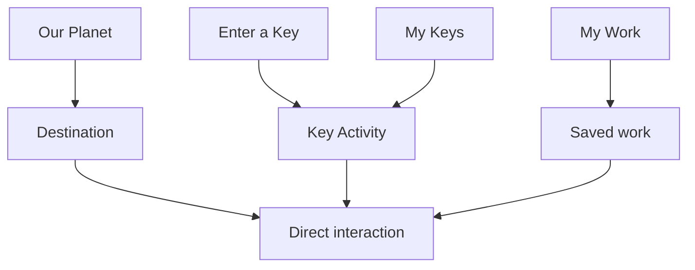
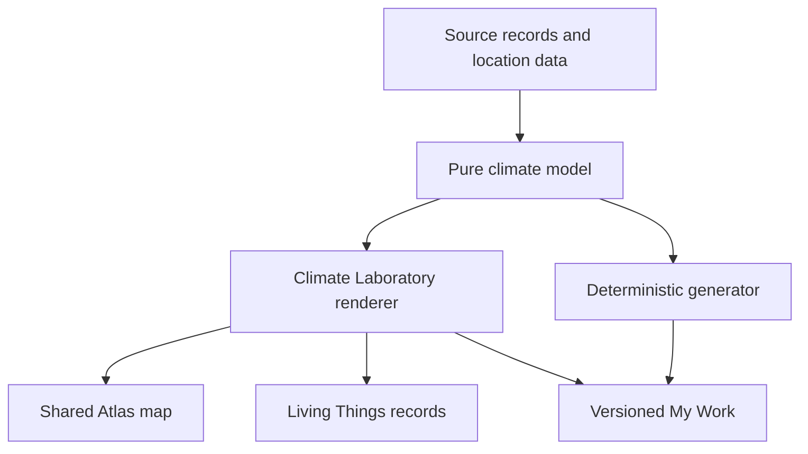

# Build 4 architecture

## Product boundary

Build 4 has four active, openly explorable destinations:

- `planet-atlas`
- `number-expedition`
- `living-things-observatory`
- `climate-laboratory`

`materials-river` is the next permanent registry record but remains inactive. Later destinations also remain records only. Child-facing consumers must use `getActiveDestinations()` rather than rendering the complete registry.

## Interaction invariants

The product-wide flow repair makes these implementation rules:

1. Child navigation contains only Our Planet, My Keys, My Work and Enter a Key.
2. Completed destinations belong in Our Planet; saved outcomes belong in My Work; guided pathways belong in My Keys.
3. The primary screen types are Our Planet, Destination and Key Activity.
4. Destination entry renders a useful interactive object immediately.
5. A destination exposes no more than four primary modes.
6. The main learning action has higher visual weight than save, print, help, reset, Board View and settings.
7. More tools is contextual disclosure, not an intermediate landing page.
8. Draft persistence is quiet; meaningful outcomes use Keep in My Work.
9. Show me stays within the current task.
10. Released IDs, codes, routes, profile IDs, data and accessibility settings are preservation contracts.

The complete future-build rules are in [Interaction Constitution](INTERACTION-CONSTITUTION.md).

## Application shell

`src/components/AppShell.js` renders one shared header and exactly four primary navigation controls. The application-level route label, profile indicator and accessibility entry are consistent across destinations. Destination components provide one title, one logical return control, one save status and Board View where supported.

No destination creates its own top-level navigation, save vocabulary or incompatible exit behaviour.

## Home and libraries

### Our Planet

`renderHomeView()` derives four landmarks from the active destination registry. Each has one symbol, short title, short invitation and touch target. The home may show one continuation invitation and a compact Today’s Key entry. It never renders inactive destinations.

### My Keys

`renderKeysView()` is a remembered collection rather than a task list. It renders:

- one most-recent Continue item
- one search field
- destination-grouped activities
- one Continue or Revisit action per item

Codes, multiple dates, curriculum paragraphs, completion scores and assignment language are omitted from the child view.

### My Work

`renderWorkView()` has three stable filters: `recent`, `by-place` and `planet-thinking`. Artefact categories remain metadata filters rather than separate child libraries. Item menus disclose duplicate, version, print and delete actions after opening.

### Enter a Key

The keypad resolves automatically after the fourth digit:

- Activity: remember and open the exact activity
- Collection: remember its activities and offer a single first-pathway/library decision
- Destination: retain a future wildcard and return to open exploration without interrupting it
- Whole World: retain `world:*`, synchronise current activities and return calmly
- `8584` or hidden compatibility alias `4829`: open an in-memory adult session before any learner write

## Route model and logical returns

Hash routes remain GitHub Pages and offline safe.

| Route | Screen | Default logical return |
|---|---|---|
| `#/home` | Our Planet | — |
| `#/atlas` | Planet Atlas | Our Planet |
| `#/numbers` | Number Expedition default workbench | Our Planet |
| `#/number-tool/:id` | Number tool | Number Expedition or captured caller |
| `#/living-things` | Observatory default workbench | Our Planet |
| `#/science-tool/:id` | Science tool | Observatory or captured caller |
| `#/climate` | Climate default scene | Our Planet |
| `#/climate-tool/:id` | Climate tool | Climate Laboratory or captured caller |
| `#/activity/:id` | Guided activity | My Keys, destination or captured key-entry caller |
| `#/collection/:id` | Collection | My Keys |
| `#/keys` | My Keys | Our Planet |
| `#/work` | My Work | Our Planet |
| `#/work/:id` | Saved work | My Work |
| `#/key` | Four-digit entry | Captured child context |
| `#/settings` | Accessibility | Captured child context |
| `#/maintenance` | Teacher Key Room | Captured child context; active adult session only |

`App` keeps explicit prior context for activities, work, Board View and teacher entry. It does not rely on arbitrary browser-history traversal. A fresh document at `#/maintenance` has no adult session and is guarded back to Enter a Key.

## Destination entry contracts

### Planet Atlas

The current globe/map is the primary object. Existing projection, layer, scale, journey and saved-place engines remain authoritative. Climate Map mounts the same `AtlasMap` component and its detailed geography chunk rather than a copied map.

### Number Expedition

Entry opens the central Build a Number workbench. Build, Compare, Calculate and Reason are the primary mode vocabulary. The original 17 mathematical tools and 28 guided activities still use the pure modules in `src/maths/`.

### Living Things Observatory

Entry opens the observation workbench. Observe, Group, Classify and Habitats are the primary modes. The original 18 tools, 56 organisms, classification engine, habitat records and environmental-change records remain authoritative.

### Climate Laboratory

Entry opens `temperature-rainfall-lab` with the living scene and only temperature/rainfall controls. Patterns, Climate Map, Experiment and Change are primary modes. Each mode exposes four tools only through a small contextual More tools list.

## Climate module boundaries

| Module | Responsibility |
|---|---|
| `src/data/climate.js` | Sources, locations, zones, biomes, scenarios, 16 tools, 14 activities, five collections and destination key |
| `src/climate/model.js` | Totals, ranges, seasonality distribution, comparisons, simplified scene, biome possibilities and data validation |
| `src/climate/generator.js` | Seeded weather/climate, location, seasonality, model, effects and response tasks |
| `src/destinations/climate-laboratory/ClimateLaboratory.js` | Accessible interaction, graphs, scene, evidence editor, Board View and save envelope |
| `src/destinations/climate-laboratory/climate-laboratory.css` | Responsive workspaces, non-colour patterns, reduced motion and A4 print behaviour |

The UI imports facts; it does not embed alternate station arrays. Full model details are in [Climate Architecture](CLIMATE-ARCHITECTURE.md).

## Key architecture

`src/data/keys.js` is the released key authority used by child routing, grants, My Keys, Teacher Key Room and printing.

| Type | Build 4 count |
|---|---:|
| Activity | 66 |
| Collection | 19 |
| Destination | 4 |
| Whole World | 1 |
| Adult-only | 2 |
| **Total** | **92** |

The 72 Build 1–3 ID/code pairs are hashed in `tests/build4-climate-data.test.js`. Build 4 adds 20 records without editing those pairs.

Wildcard permissions remain:

- `activity:<id>`
- `destination:<id>:*`
- `world:*`

`syncGrantedActivities()` materialises newly active activities from an existing wildcard. Keys direct attention; they do not gate open destination entry.

## Teacher Key Room

The room projects 90 active child records from the central manifest. It excludes both adult entries. `TeacherKeyRoom` begins with no environment code wall: favourites and recent display records render first, followed by four active destination filters and search.

Teacher state has two distinct lifetimes:

- adult access is an in-memory session and disappears on a real refresh
- favourites/recent-display choices are schema-versioned device metadata without a learner profile ID

Climate keys require no hand-maintained teacher list; destination, topic, outcome, Board and print metadata come from activity/key records.

## Persistence and migration

Database `our-planet` is schema version 4. Existing stores remain unchanged:

| Store | Role |
|---|---|
| `profiles` | Local learner identities and settings |
| `keyGrants` | Stable activity/destination/world permissions |
| `keyAccess` | Profile-specific remembered activity visits |
| `artefacts` | Latest shared My Work records |
| `artefactVersions` | Immutable revision history |
| `planetResponses` | Append-only central-enquiry thinking |
| `activityState` | In-progress guided activity state |
| `metadata` | Device and namespaced flow preferences |

The version-4 migration is additive: it ensures stores/indexes and writes the schema record. It does not clear or rewrite learner records. Climate uses the existing versioned artefact and activity-state services.

`flowPreferences.js` stores `flow:profile:<profileId>` metadata containing only a recent destination/route plus My Keys/My Work view choices. The service verifies the profile exists and sanitises every value, preventing shared-iPad leakage.

Climate artefacts keep data values and provenance together:

- location/source IDs and copied source summaries
- units, reference period and `sourced-rounded` / `simplified-model` / `fictional` status
- temperature, rainfall and seasonality values
- observed, known, inferred, predicted and uncertain statements
- activity ID, scaffold and deterministic generator seed
- optional voice explanation and linked artefacts

## Save and revision semantics

Destination interactions may remain temporary. Guided drafts use activity-state persistence. **Keep in My Work** creates a meaningful artefact. Reopening records the originating library context and restores the semantic model rather than a screenshot.

Saving a reopened artefact uses `updateArtefact()` and appends an immutable version. Duplicating creates a new identity. Board View never writes learner work.

## Accessibility

Shared requirements include:

- minimum touch targets and keyboard operation
- native buttons, range inputs, selects, textareas and labelled SVGs/HTML
- step alternatives for every climate range input
- persistent units and visible comparison labels
- patterns/lines/shapes as well as colour
- spoken instructions and values with visual equivalents
- reduced-motion CSS and no timing requirement
- enlarged-text reflow without nested horizontal workspaces
- explicit evidence categories and saved partial work

Progressive disclosure never hides profile, accessibility, units or essential instructions.

## Board View

Each supported destination snapshots its exact model before opening Board View. Board View removes learner identity and save actions, protects against accidental edits and exposes only teaching controls. Exiting restores the snapshot and captured activity context.

Climate Board View supports all 15 Climate artefact families through the same tool renderer, including graphs, comparisons, experiments, biome/habitat connections, evidence and trade-offs.

## Print

Global `src/styles/print.css` establishes A4 pages and removes the application shell. Destination styles preserve domain-specific objects:

- Atlas maps and place evidence
- mathematical alignment and true-scale number lines
- organism images and classification branches
- climate graphs, seasonal strips, units, source periods and evidence categories

Climate rainfall uses hatching as well as bar height/colour. Print applies grayscale and black strokes, keeps major figures together and suppresses controls. Key cards and Key Guides use the same manifest projection as the Teacher Key Room.

## Offline and performance

Vite splits Number Expedition, Living Things Observatory, Climate Laboratory, Atlas map and detailed world geography. Destination modules mount only for matching routes and are destroyed on exit. Climate Map shares Atlas code and cached geography rather than adding a second mapping engine.

`npm run build` hashes the production asset list and injects it into `public/service-worker.js`. The worker keeps a known-good shell, removes older cache versions and serves cached route assets after the first successful online load.

## Build 5 extension boundary

The `materials-river` registry record reserves its permanent ID, ordinal and compatible concepts only. It may later link material quantities to Number Expedition, habitat effects to Living Things Observatory and climate implications/trade-offs to Climate Laboratory. Build 4 provides no Materials River tools, keys, panels or child-facing landmark.
