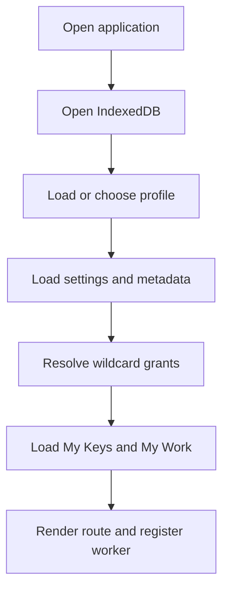
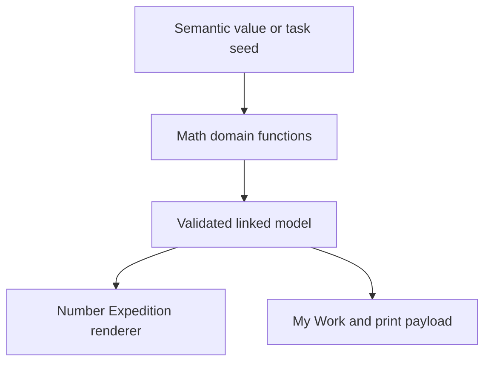
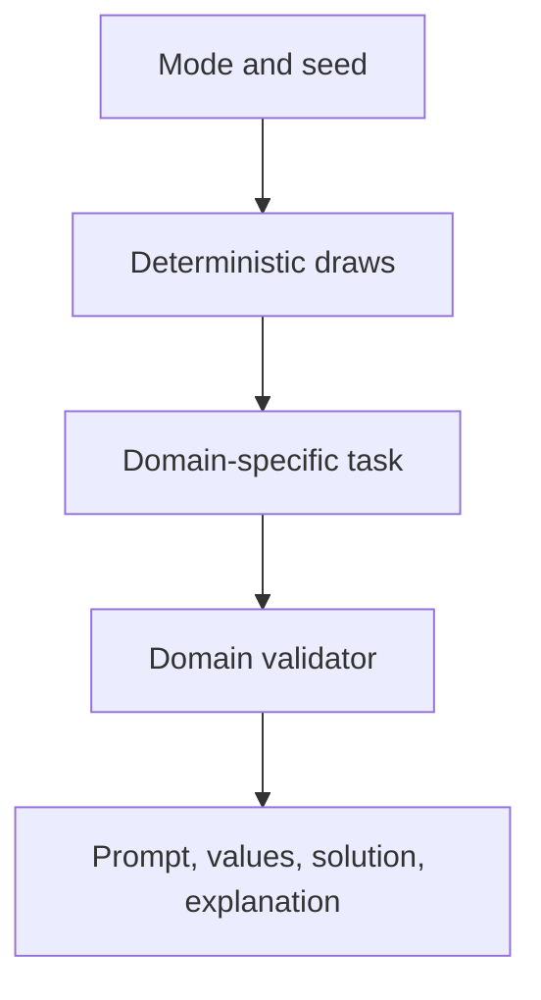
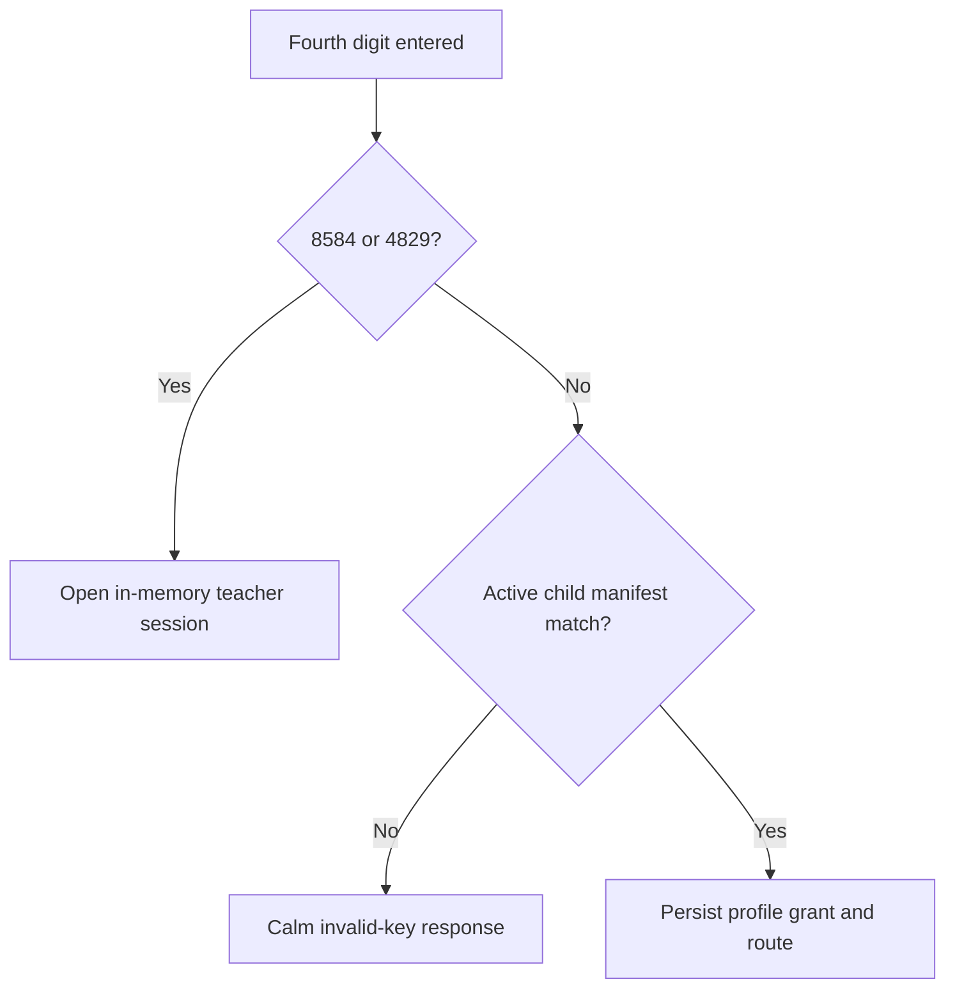

# Architecture

## Current product boundary

Build 3 has three active child environments:

- `planet-atlas`
- `number-expedition`
- `living-things-observatory`

The remaining seven destination records are future contracts. They stay inactive until their child experience, guided pathways, persistence, accessibility, print, offline assets, and tests are complete.

## Product invariants

These rules are architectural rather than presentational:

1. Every completed environment is open without a key.
2. Keys remember and route to guided pathways; they do not grant ordinary exploration.
3. Child navigation remains Our Planet, My Keys, My Work, and Enter a Key.
4. One profile’s keys, work, drafts, responses, and settings never leak into another profile.
5. One shared artefact envelope serves every environment.
6. Released key codes and stable IDs are never reassigned.
7. Destination and world wildcards retain future meaning.
8. Later builds use additive migrations and preserve all prior local data.
9. Inactive destinations produce no child-facing dead controls.
10. `8584` is permanently reserved for the Teacher Key Room.
11. `4829` remains a hidden adult compatibility alias and is never repurposed or advertised.
12. Adult access is intercepted before learner persistence and lasts only for the current app session.
13. Teacher favourites are device metadata, never learner data.
14. Mathematical representations derive from semantic values, not independent screen copies.
15. Physical art is documented digitally without being replaced by a drawing app.
16. Organism records, images, classifications, habitats, and sources use permanent local IDs and validation.
17. Environmental predictions are stored separately from observations and established knowledge.

## Application startup

If IndexedDB cannot open, the service API switches to in-memory storage for that page session. The UI remains operable and exposes that saving is not durable.

## Route model

Hash routes keep GitHub Pages hosting simple and offline-safe.

| Route | Purpose | Access |
|---|---|---|
| `#/home` | Open world and Today’s Key | Profile |
| `#/atlas` | Open Planet Atlas | Profile; no key |
| `#/numbers` | Number Expedition regions | Profile; no key |
| `#/number-tool/:id` | One open mathematical instrument | Profile; no key |
| `#/living-things` | Open Living Things Observatory | Profile; no key |
| `#/science-tool/:id` | One open scientific instrument | Profile; no key |
| `#/keys` | Remembered guided pathways | Profile |
| `#/collection/:keyId` | One coherent key collection overview | Profile; collection activities are remembered on key entry |
| `#/work` | Unified child workspace | Profile |
| `#/work/:id` | Saved artefact | Owning profile |
| `#/key` | Four-digit entry | Profile |
| `#/activity/:id` | Exact guided pathway | Matching remembered grant |
| `#/settings` | Learner accessibility settings | Profile |
| `#/maintenance` | Teacher Key Room | Active adult session only |
| `#/print/key-guide` | Legacy shared Key Guide route | Active adult session only |

The route guard sends direct maintenance or guide navigation back to key entry unless both the app unlock flag and the in-memory teacher session are active.

## Destination registration

`src/data/destinations.js` contains all ten destination contracts. Each record contains a stable ID, ordinal, title, route, activation state/build, curriculum domains, and home-world landmark.

The home world derives its child-facing destinations from `getActiveDestinations()`. Build 3 explicitly activates Living Things Observatory after its data, interaction, persistence, print, offline, and regression contracts pass.

## Activity registration

`src/data/activities.js` is the combined active activity registry.

- Planet Atlas contributes eight continuous guided pathways.
- `src/data/numberExpedition.js` contributes exactly 28 Year 4 Autumn 1 pathways.
- `src/data/livingThings.js` contributes exactly 16 Year 4 science pathways.

Every Number Expedition and Living Things Observatory activity supplies:

- stable ID, order, route, region, and open-tool ID
- permanent four-digit code
- child title and invitation
- curriculum objective and tags
- concept and vocabulary tags
- Notice / Explore / Make / Explain / Revisit content
- optional unscored Key Check
- misconception metadata
- per-scaffold behaviour
- semantic My Work outcome and print metadata

Lesson numbering may exist in curriculum metadata, but it is not the child-facing organisation.

## Number Expedition manifest

`src/data/numberExpedition.js` is the destination-level source for:

- seven region records
- 17 open-tool records
- 28 activity records
- seven collection records
- the Number Expedition Environment key record
- manifest validation

The seven regions are `number-base-camp`, `magnitude-trail`, `rounding-ridge`, `beyond-zero-station`, `addition-workshop`, `subtraction-workshop`, and `reasoning-observatory`.

An activity selects a reusable open tool through `toolId`; it does not implement a second incompatible mathematical engine. Guided activity metadata changes the starting values, invitation, scaffold cue, Key Check, and outcome identity while preserving the same instrument.

## Shared mathematics engine

The pure domain layer lives in `src/maths/`. It can be tested without a browser or learner database.

| Module | Responsibility |
|---|---|
| `placeValue.js` | Thousands / Hundreds / Tens / Ones, zero placeholders, exchanges, UK number names, linked representations |
| `partitions.js` | Standard, non-standard, incomplete, different-value, and invalid partition classification |
| `rounding.js` | Lower/upper multiples, midpoint, distances, direction, and target-unit validation |
| `romanNumerals.js` | Canonical 1–100 conversion, strict parsing, and repair of non-canonical forms |
| `operations.js` | Column-aligned addition/subtraction traces and exchange classification |
| `numberLine.js` | Values, endpoints, intervals, true visual ratios, and placement tolerances |
| `inverse.js` | Addition/subtraction fact families and missing mathematical roles |
| `feedback.js` | Structure-specific mathematical feedback |
| `truthFixtures.js` | Validated always / sometimes / never evidence and witnesses |
| `random.js` | Functional deterministic random state |
| `taskGenerator.js` | Seeded task generation and cross-domain validation |

### Linked representation contract

One place-value source creates the numeral, UK number name, digits, source counts, normalised counts, expanded form, place-value chart, counters, and spoken language. A non-canonical source such as ten hundreds preserves the child’s construction while also exposing the equivalent canonical value.

The renderer therefore does not maintain separate mutable values for counters, chart, numeral, and language. A change is applied to one semantic source and all linked views are regenerated.

### Formal operation traces

Addition and subtraction traces operate from ones towards higher places while keeping each exchange attached to a named column. Trace records contain original digits, current counts, incoming/outgoing exchange, result digit, ordered steps, exchange count, and validated result.

Subtraction across zero stores each adjacent exchange in sequence. For `4,002 − 1,786`, the trace moves thousand → hundred → ten → one and records the updated source and target count after each exchange.

### Number-line scale

Every tick stores both a mathematical value and a rendered ratio. Validation rejects a visually equal layout when its labelled values imply a different interval. Placement feedback is calculated in value units rather than pixels.

## Deterministic task generation

`generateNumberTask(mode, seed, options)` is the single generator API for all 28 activities and open-tool modes.

Each result contains a deterministic ID, serialisable seed, generator version, curriculum tags, prompt, semantic values, validated solution, and explanation. Selected exchange categories are generated by checking the completed arithmetic trace, not by assuming the random inputs fit. Rounding, Roman numeral, number-line, partition, inverse, problem, and truth-statement tasks use their own domain validators.

Saving retains the generator seed and version so a later session can explain or reproduce the original task.

## Number Expedition UI state

`src/destinations/number-expedition/NumberExpedition.js` owns one local workspace state per open instrument.

Core state includes:

- schema version, tool ID, mode, and optional activity ID
- semantic values and representation choices
- generator seed, generated task ID/version, and challenge number
- explanation and annotation
- label and answer visibility
- Board View step

Open-tool state lives in the current app instance until saved. Guided activity state also uses the shared `activityState` service so unfinished activity work can survive refresh. Undo and redo keep a bounded in-memory history without creating artefact versions for every tap.

## Key architecture

`src/data/keys.js` is the one released key manifest consumed by routing, key access, teacher search, and printing. UI modules never embed their own authoritative code list.

### Build 3 manifest composition

| Type | Count | Source |
|---|---:|---|
| Activity | 52 | 8 preserved Atlas + 28 Number Expedition + 16 Living Things Observatory |
| Collection | 14 | 2 preserved Atlas + 7 Number Expedition + 5 Living Things Observatory |
| Environment | 3 | Planet Atlas + Number Expedition + Living Things Observatory |
| Whole World | 1 | Preserved Build 1 wildcard |
| Adult-only | 2 | `8584` canonical + hidden `4829` alias |
| **Total** | **72** | Central manifest |

`getProductionTeacherKeys()` returns the 70 active child pathway records and excludes both adult records.

### Resolution order

Teacher resolution happens before `grantKey()`. Neither adult code can create a `keyGrant`, `keyAccess`, visit, activity state, or My Work record.

### Permission forms

- `activity:<id>` — one stable activity
- `destination:<id>:*` — all present and future activities in one destination
- `world:*` — all present and future activities across the product

The stored wildcard grant is the long-term permission source. `syncGrantedActivities(profileId, currentRegistry)` materialises matching active activities into My Keys without rewriting the wildcard.

### Permanent adult codes

`src/teacher/teacherKeyManifest.js` defines the cross-record adult invariants used in addition to the central key validator:

- `8584` / `key-teacher-key-room` is the canonical, public Teacher Key Room entrance.
- `4829` / `key-maintenance-adult-utility` remains active only as a hidden Build 1 compatibility alias.
- both have adult capabilities only and no child activity grant
- neither may appear in the production teacher library
- no third active adult entrance is allowed
- collisions, missing aliases, altered stable IDs, malformed wildcards, inactive production entries, and child grants on adult records fail validation

## Teacher Key Room

The teacher subsystem is separated into small modules:

| Module | Responsibility |
|---|---|
| `teacherKeySession.js` | In-memory session, adult-code interception, captured return location |
| `teacherKeyManifest.js` | Permanent adult constants and cross-manifest validation |
| `teacherKeyLibrary.js` | Active manifest projection, search, filters, grouping, Quick Keys |
| `teacherKeyPreferences.js` | Device metadata favourites and title-display preference |
| `teacherKeyPresentation.js` | Clipboard, full-screen Today’s Key, and print surfaces |
| `TeacherKeyRoom.js` | Accessible room UI and utility orchestration |

### Session boundary

The session controller is a JavaScript singleton only. It does not use localStorage, sessionStorage, IndexedDB, or a profile. Refresh constructs a new inactive controller. Closing consumes the validated return-location snapshot.

The maintenance route requires both an active session and the controller’s unlock flag. Exiting returns to the captured child route where practical.

### Manifest projection

The library derives searchable entries from active child records. Each entry receives a normalised scale, environment, curriculum subject, strand, purpose, curriculum tags, route, saved outcome, suggested use, Board suitability, approximate time, and print metadata. Search examines the code, title, purpose, environment, subject, strand, and tags. Science topic chips apply the same projection; no second science key list exists.

Inactive records and both adult entrances are excluded before rendering. Future active manifest records therefore appear automatically without a separate teacher list.

### Device preferences

Teacher favourites use metadata key `teacher-key-room:device-preferences`, schema version 1. The record contains at most 12 manifest-valid child key IDs plus the show-title-on-board preference. It has no `profileId` and participates in the existing backup/import contract.

### Presentation and print

The full-screen Today’s Key overlay contains a four-digit code, an optional title, and one return control. It requests browser fullscreen when available and remains a fixed viewport overlay if fullscreen is denied. Closing restores focus to the invoking control.

Printable cards and guides are rendered from the same library projection with escaped content and a temporary print-only surface.

## IndexedDB schema and compatibility

Database: `our-planet`, schema version 3.

| Store | Key | Role |
|---|---|---|
| `profiles` | profile ID | Local learner identity and accessibility snapshot |
| `keyGrants` | profile + stable key | Permanent permission contract |
| `keyAccess` | profile + activity | Materialised My Keys record and visits |
| `artefacts` | artefact ID | Current saved creation |
| `artefactVersions` | artefact + version | Immutable version snapshots |
| `planetResponses` | response ID | Append-only central enquiry history |
| `activityState` | profile + activity | Unfinished guided work |
| `metadata` | metadata key | Active profile, settings, teacher preferences, migrations, recovery |

Build 3 requires no new store or database-version increment. Number Expedition and Living Things Observatory write to existing `activityState`, `artefacts`, and `artefactVersions`; teacher preferences write to `metadata`.

### Migration policy

- Add stores, indexes, or optional fields only when genuinely necessary.
- Never clear or repurpose an existing store.
- Keep readers tolerant of missing optional fields.
- Validate records on read and import.
- Quarantine malformed records with a reason and timestamp.
- Preserve Build 1 and Build 2 backup compatibility.
- Test migration from every released database version.

## Shared artefact compatibility

The record envelope separates identity from domain content. Core fields identify the owner, destination, activity, optional Key Activity, type, tags, explanations, links, timestamps, and version. `content` holds the semantic domain payload.

Number Expedition registers 17 active artefact types. Their content requires `modelState` and may retain original and final values, recent mathematical actions, representations, answer state, estimate, explanation, strategy, generator seed, scaffold, activity, steps, counterexample, and units.

Living Things Observatory registers 20 science artefact types. Their content requires `scienceState` and may retain permanent organism and asset IDs, selected features, grouping memberships and rules, classification branches, question histories, habitat models, evidence/knowledge/prediction/uncertainty statements, survey provenance, generator seed, cross-destination links, and validated child-created challenge data. Broken-key records retain both the deliberate fault and the selected repair.

`updateArtefact()` writes the prior and new states to `artefactVersions`. `duplicateArtefact()` creates a separate record linked to the source. Reopening a mathematical or scientific artefact restores its original tool and semantic state instead of displaying only a static image.

Planet Question responses remain separate because their append-only comparison timeline is a distinct product behaviour.

## Board View

Board View is rendered from the same Number Expedition or Living Things Observatory state and model renderer as the learner workspace. It does not create a second calculation, scientific record, or saved-work mutation merely by opening.

It exposes context-appropriate previous/next, reveal, reset, and annotation controls with one explicit exit. Returning reveals the same workspace state. The fixed surface uses classroom-scale layout, anonymises learner work, and hides normal workspace chrome.

The Teacher Key Room’s full-screen code display is a separate presentation component and does not share learner model state.

## Planet Atlas engine

`AtlasMap` remains a self-contained dynamically imported component. It uses `d3-geo`, `topojson-client`, compact `world-atlas` geometry, and a lazily loaded detailed geometry chunk. It owns no learner storage; the app saves its semantic state through the shared artefact service.

Build 3 does not change Atlas IDs, routes, map-state meaning, geography provenance, or existing artefact contracts. Science links request a researched Atlas context while explicitly separating a map location from proof of species presence.

## Accessibility separation

Settings are stored per learner and applied to the document and interactive components. They include scaffold level, text scale, spoken instructions, place-name speech, captions, reduced motion, reduced complexity, high contrast, and sound volume.

Number Expedition uses stable column positions, input labels, large controls, keyboard-operable native inputs, non-drag controls, undo/redo, spoken-number support, and reduced-motion CSS. Living Things Observatory adds large zoomable organism illustrations, colour-independent selections, tap-to-place sorting, persistent rules and question histories, spoken names, semantic HTML/SVG classification trees, and compact scaffold-sensitive organism sets. Scaffold metadata changes prompts and visible support without changing permission, scoring, or the objective.

## Offline build

Vite emits content-hashed chunks. `scripts/inject-sw-assets.mjs` scans `dist`, excludes source maps and the worker itself, and injects every deployable file into the worker’s precache list.

This includes the dynamically imported Atlas, Number Expedition, and Living Things Observatory chunks plus local organism, habitat, glossary, print, and core audio contracts. A learner can therefore install from the home world and later open any completed environment offline.

The deployment workflow serialises against the repository's remaining legacy branch Pages publisher, then deploys the built artefact last. This prevents the branch job from overwriting `dist` with raw source while retaining a clean migration path to a GitHub-Actions-only Pages source setting.

The worker waits rather than replacing an active build mid-session. Cache cleanup is scoped to this repository. IndexedDB is independent of CacheStorage and is not erased by deployment or worker activation.

## Print architecture

Teacher guides and cards use the active manifest projection as their only code source. My Work, Number Expedition, and Living Things Observatory use semantic markup rather than screenshots.

Print CSS removes navigation and controls, uses A4 margins and monochrome-safe colours, repeats table headings, protects card and artefact boundaries, preserves digit alignment and SVG number-line geometry, and keeps organism images, evidence labels, and classification branch lines attached to their records.

iPad Safari pagination and clipping remain manual release checks because they cannot be fully established by Node or CSS-contract tests.

## Tides of Change contracts

Art curriculum, artist metadata, artwork rights, and physical-art artefact types remain registered and inactive until Build 10. Metadata about an artwork is not permission to reproduce it.

## Build 4 extension points

Climate Laboratory can extend the released Build 3 architecture through:

- sourced weather and climate records with source year, unit, location, and rounding notes
- broad climate-zone and biome links that reuse Atlas place IDs and science habitat IDs
- signed temperature, rainfall, seasonality, and Number Expedition representation adapters
- evidence/knowledge/prediction/uncertainty statements using the released science model
- climate Activity / Collection / Environment records in the central manifest
- local deterministic scenario generation and validation
- shared artefact, profile, Board View, print, backup, teacher, glossary, concept-graph, and offline services

Build 4 must not infer species presence from a climate zone, turn one variable into a complete biome simulation, repurpose released codes or IDs, or create a climate-only account or work store.

The detailed Build 3 scientific contracts are in [Living Things Technical Architecture](SCIENCE-ARCHITECTURE.md), and the next-build boundary is in [Build 4 Handover](BUILD-3-HANDOVER.md).
