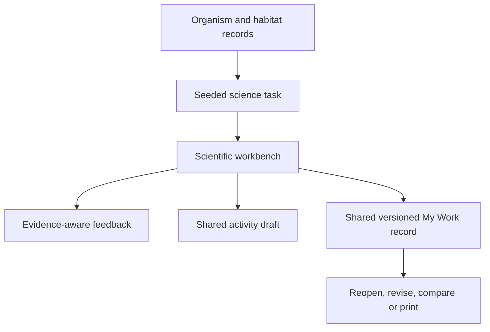

# Living Things Observatory technical architecture

## Boundary and extension rule

Living Things Observatory is the third active destination inside the existing application. It does not own a second profile, key, persistence, Board View, print, backup, or offline system. Its destination route is `#/living-things`; open tools use `#/science-tool/:id`; guided work continues to use `#/activity/:id`.

The data flow is:



## Organism schema

`src/data/organisms.js` is the one local organism and habitat library. Each organism has:

- permanent `id`, common name, scientific name, kingdom, broad category/group, subgroup, and vertebrate status
- observable characteristics plus structured body covering, visible limbs, wings, shell, exoskeleton, segmentation, and movement
- approved binary feature IDs used by classification questions
- one or more habitat IDs, a simple food relationship, broad occurrence context, and UK/Gambian flags where researched
- child description, teacher note, pronunciation, misconception warnings, curriculum tags, and classification-key compatibility
- local `illustrationKey`, complete image-rights metadata, and one or more source references with retrieval dates

Plants use `backbone: null`. Animals must use exactly `vertebrate` or `invertebrate`. Broad vertebrate groups must agree with backbone status. Adult insects require six visible legs in the shown record; adult arachnids require eight. A record may refer only to registered habitats and a locally renderable illustration.

`validateOrganismLibrary()` rejects duplicate IDs, missing core fields, contradictory status/group fields, missing rights or sources, absent/unknown habitats, and insufficient binary features. The validation deliberately checks the dolphin, insect, arachnid, bird, plant, and missing-licence failure classes named in the Build 3 brief.

## Feature vocabulary and illustration contract

`binaryFeatures` are stable machine-readable facts for this selected record/view, such as `backbone`, `feathers`, `six-legs`, `shell`, or `prop-roots`. They are not child-facing claims that one feature identifies every member of a scientific group. `src/science/classification.js` supplies the careful question labels and whether each question is immediately observable or requires the information card.

`src/science/illustrations.js` renders original, consistent inline SVG from `illustrationKey`. SVG is semantic and contains a title and description. The product labels each view **Original diagram · not to scale** and warns that the feature record is the scientific evidence. No illustration is represented as a photograph or exact measurement.

## Classification-tree model

A complete tree is a nested serialisable object:

```js
{
  id: 'question-1',
  type: 'question',
  questionId: 'has-backbone',
  label: 'Does it have a backbone?',
  organismIds: ['red-fox', 'western-honey-bee'],
  yes: { type: 'result', organismId: 'red-fox', organismIds: ['red-fox'], complete: true },
  no: { type: 'result', organismId: 'western-honey-bee', organismIds: ['western-honey-bee'], complete: true }
}
```

Question nodes have exactly `yes` and `no` children. A complete result has exactly one known organism. `validateClassificationTree()` traverses from the root, verifies known questions, checks each question against the node’s organism set, detects object loops, rejects missing branches, collects every endpoint, and confirms each selected organism appears exactly once.

## Binary-question validation

An approved question stores a stable ID, child-facing label, one binary feature, and observation/known-information metadata. `validateBinaryQuestion()` verifies:

- the record and selected organisms exist
- wording resolves to a known binary fact
- every organism follows exactly one outcome
- both outcomes receive an organism when the set contains more than one record
- the question is useful for this selected set

`analyseCustomQuestion()` separately explains why opinion words, vague size terms, non-question wording, or open-ended wording are not yet repeatable binary questions. It does not silently turn a child’s wording into an approved scientific fact.

## Deterministic organism-set generation

`generateScienceTask(mode, seed, options)` uses the same functional random-state foundation as Number Expedition. Identical mode, seed, and options yield identical semantic tasks. The result stores generator version, curriculum tags, selected set, organism IDs, and mode-specific data.

Generators support comparison, observation, sorting, backbone/group sets, complete keys, Mystery Organisms, deliberate broken keys, habitats, microhabitats, habitat models, environmental change, survey rows, and challenge foundations. Validation rejects duplicate/missing organism IDs, incomplete generated trees, unknown habitats, or unknown change scenarios.

Authored classification sets are preselected for useful similarities, differences, counterexamples, and complete key compatibility. Broken-key fixtures intentionally isolate one known fault while preserving a possible repair; their own validator is separate from the valid-key validator.

## Habitat schema

A habitat record contains stable ID, title, scale, Atlas links, condition list, resource list, and a cautious description. An organism may reference several habitats. A microhabitat contains one or more parent-habitat IDs, local conditions, and likely organism IDs.

Habitat Builder stores a simplified model with water, vegetation, shelter, ground, temperature, light, disturbance, and space. `evaluateHabitatModel()` reports resources present and needs still worth checking. It never claims that one combination is a complete real habitat or an organism’s only home.

Atlas links are stored as stable place references. `river-gambia` opens the researched Gambia context; `atlantic-ocean` opens the Atlas world/ocean context. Saved science work retains the resolved Atlas place IDs and explicitly states that map context is not proof of species presence.

## Environmental-change and evidence model

A change scenario stores:

- stable ID, title, habitat ID, and one clearly defined change
- changed condition and affected resource/need
- direction of change
- direct evidence represented by the model
- important uncertainty
- two or more plausible possible effects

The child state stores four separate strings: `evidenceStatement`, `knownStatement`, `predictionStatement`, and `uncertaintyStatement`. Saved content repeats these under `changeScenario` so My Work and print preserve the distinction. Authored language uses *may*, *could*, *if*, *depends on*, or an explicit need for more evidence. No scenario is scored and no response is treated as moral approval.

## Activity and challenge state

`defaultScienceState()` creates one serialisable state for every scientific tool. It includes schema version, tool/mode/activity IDs, seed/task, organism set, selected evidence, group state, question history, tree/question choices, habitat/change/survey state, optional local photograph, explanation/annotation, recent child actions, and Board state.

Light/Core/Strong/Intensive change organism count and cue density without changing the objective. Saved guided state uses the shared `activityState` store; open-tool state remains in the app instance until saved. Optional survey photographs are checked for image MIME type and a 2 MB input limit; large data URLs are removed before artefact serialization.

Challenges remain local. Before save, the creator checks type-specific organism count, permanent organism IDs, locally available assets, instructions/evidence, and the relevant classification tree, deliberate broken-key fixture, habitat record, or environmental-change scenario. A valid Mystery challenge stores its hidden organism and complete branch logic; key challenges store a complete validated tree; broken-key challenges store one deliberate fault with possible repair metadata. There is no public sharing, upload, child code, teacher assignment, or external AI generation.

## Artefact serialization and migration

Twenty science artefact types are registered in `src/data/artefactTypes.js`. All require `scienceState` and share the versioned artefact envelope. `structuredContent` may additionally store organism IDs, local illustration/right references, selected features, group memberships, grouping rule, branch logic, question history, before/after key repair, habitat model, environmental-change labels, survey rows, provenance, generator seed, validated challenge data, linked Atlas places, and linked Number Expedition tools.

Guided science save links the artefact to existing activity access and visit records. Reopening restores the semantic workbench, not a screenshot. Revising first appends an immutable version snapshot. Duplicating creates an independent record. Board View never writes to the draft and restores a pre-Board snapshot.

Build 3 does not change the IndexedDB version or create a science-only store. The exact Build 2 production stores remain at database schema version 3. Science data is additive inside already versioned, validated envelopes, so existing profiles, keys, Atlas work, mathematical work, Planet Question responses, settings, teacher favourites, Board preferences, and wildcards need no destructive migration.

## Teacher, print, accessibility, and offline contracts

Science keys are ordinary central-manifest records. The 8584 library derives search, Science/environment/scale filters, quick topics, saved outcome, suggested use, Board suitability, timing, display, copy, open, and print actions from those records.

Scientific print output uses accessible HTML and local SVG. Branch connectors are CSS borders and remain attached to nested branch labels in monochrome. Organism grids, habitat windows, broken-key panels, survey tables, and evidence blocks avoid breaks where practical. Controls are removed through the shared `.no-print` contract.

The scientific UI provides large local diagrams, zoom and silhouette views, hidden/revealed names, spoken names through browser speech synthesis, visible text alternatives, colour-independent labels, tap-to-place grouping, two-to-five labelled group zones, undo/redo, child-question wording checks, a printable blank branching-key template, keyboard activation, persistent rules/history, no timers, and reduced-motion styling. The service-worker injection precaches the generated lazy Living Things chunk and shared CSS with the rest of the exact production bundle.

## Build 4 extension points

Climate Laboratory should reuse, not duplicate:

- `habitatId`, condition/resource, and linked Atlas-place contracts
- evidence / known / prediction / uncertain labels
- deterministic task and source metadata
- Number Expedition links for positive/negative temperature, scale, rounding, and sourced data
- concept-graph nodes for temperature, rainfall, seasonality, climate, biome, habitat consequence, and environmental change
- central keys, shared artefacts, teacher projection, Board View, print, and service-worker injection

Build 3 does not provide a biome simulator or climate slider. Build 4 must add sourced climate records and scientifically bounded variable behaviour before activating that environment.
